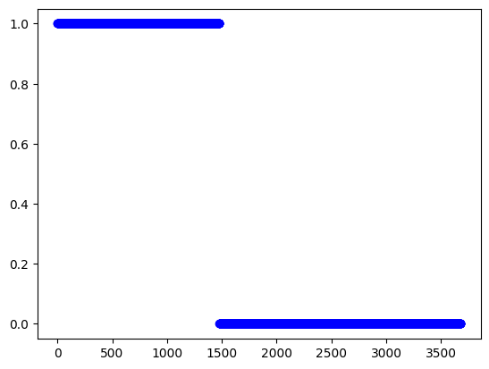
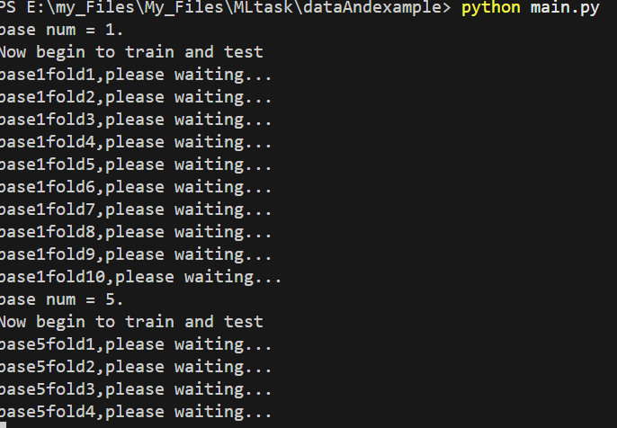
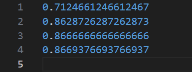

# 使用及文档说明

## 文件组织
- AdaBoostx.py,DecisonStumpx.py和main.py放在一个目录下
- 数据集data.csv共3680条，50个列
- target是3680条数据的ground truth



## 测试和评估方法
- 使用main.py训练和测试
```shell
python main.py --t your_target_dir/ --m 0
```
**注意：--m参数0表示以决策树桩为基分类器，1表示以对数几率回归为分类器**



`--t`参数指定十折测试结果保存的目录，默认为`experiments/`
- 使用evaluate.py评估
```shell
python evaluate.py --t your_target_dir/
```
可生成如图的输出:



## 使用历史算法
在main.py中修改import的AdaBoostx，可以使用其他版本的算法
